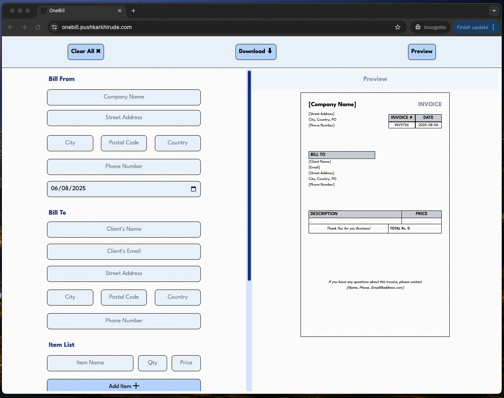
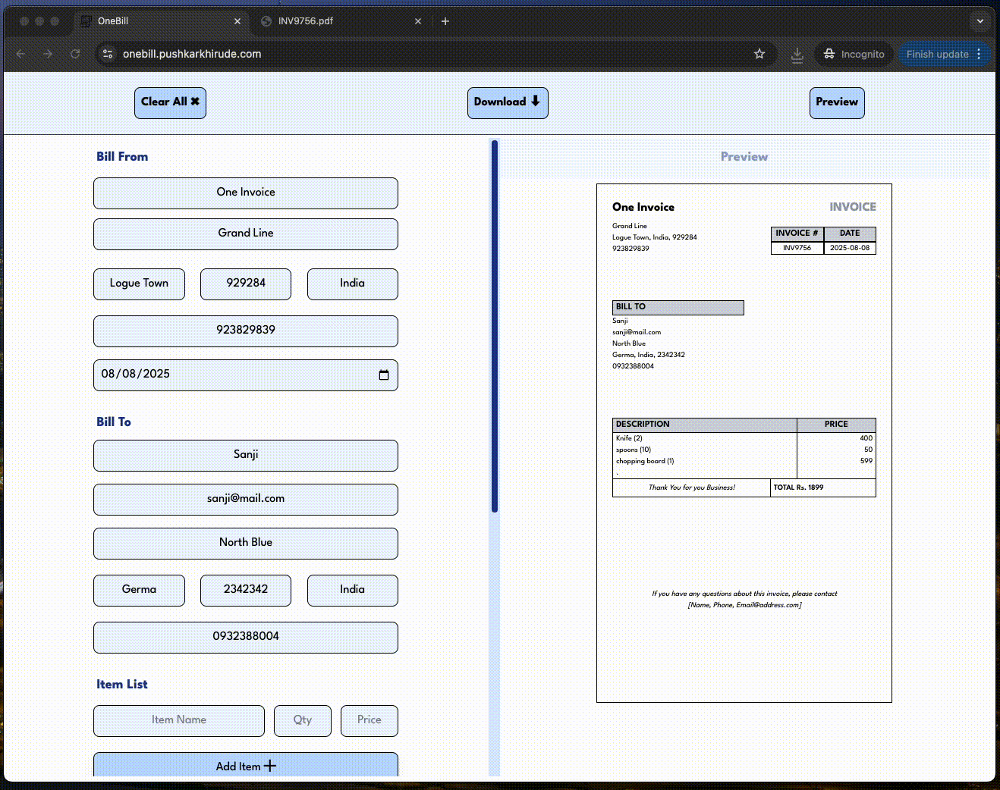

# 🧾 OneBill

A simple and responsive Invoice PDF generator built with **React.js** and **Tailwind CSS**, using the `@react-pdf/renderer` library. Instantly see your invoice updates live in PDF format as you fill out the form — smooth, real-time, and hassle-free.

[](https://reactjs.org/)
[](https://tailwindcss.com/)
[](https://react-pdf.org/)
[](LICENSE)

---

## 🎮 Demo

🚀 Live Demo: [OneBill](onebill.pushkarkhirude.com)
No sign-up needed. Just fill in your invoice details and watch the PDF update in real time!

## 🚀 Features

- 📝 Custom invoice form with real-time data entry
- ✨ Clean and minimalist UI styled in Tailwind CSS
- 📄 Live PDF preview that updates instantly
- 🎨 Custom-built invoice template
- 💾 Download the generated invoice as a PDF
- ⚡ Fast, lightweight, and mobile-friendly UI

## 🛠️ Tech Stack

- **Frontend**: React.js
- **Styling**: Tailwind CSS
- **PDF Rendering**: `@react-pdf/renderer`

## 📸 Screenshots

Responsive UI


Live updates in invoice PDF


Add and delete items from invoice


Quick and easy downloads


Click on clear all to instantly reset the invoice and start from scratch


## ✨ Future Improvements

Here are some ideas on the roadmap — and maybe more to come:

- 🖋️ Editable PDF Templates – Allow users to choose or customize invoice layouts

- 💾 Save Invoices – Save previous invoices locally or in the cloud

- 🌐 Multi-language Support – Generate invoices in different languages

- 🎨 Dark Mode – For all the late-night invoice creators out there 🌙

## 🧪 How to Run Locally

1. **Clone the repository**

```bash
git clone https://github.com/PushkarKhirude/OneBill.git
cd OneBill
```

2. **Install dependencies**

```bash
npm install

```

3. **Start the development server**

```bash
npm run dev

```

4. **Go to the localhost link provided in terminal**

## 📄 License

This project is licensed under the [MIT License](LICENSE).

## 🙌 Acknowledgements

- Huge thanks to my friends [Onkar Chavan](https://github.com/Onkar755), [Nikita Bhaise](https://github.com/Nikita-Bhaise) for their feedback and suggestions that helped refine this app.
- [react-pdf/renderer](https://react-pdf.org/) for powering the PDF magic.
- Tailwind CSS for making UI styling fast and fun.

## 📬 Contact

Got feedback, found a bug, or just want to say hey?
Feel free to reach out or silently admire the app from afar 👀💻

- 🧑‍💻 Creator: [Pushkar Khirude](https://github.com/PushkarKhirude)

- 🐦 Twitter/X: [@pushkarkhirude](https://x.com/pushkarkhirude)

- 💼 LinkedIn: [Pushkar Khirude](https://www.linkedin.com/in/pushkar-khirude-16a79a16b/)

- 📮 Email: pushkar.khirude10@gmail.com

Built with ❤️, Tailwind magic 🎨, and the eternal hope of never sending a boring invoice again 🧾✨
